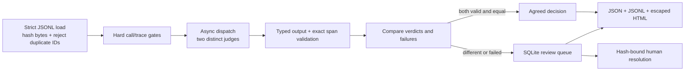

# Architecture

JuryTrace keeps deterministic gates outside judge judgment. The graph owns the
call budget, timeout boundary, evidence validation, comparison, and persistence.
Providers only turn one trajectory into one typed proposed verdict.

`StateGraph` nodes are `hard_gates`, `dispatch_judges`, `score_and_compare`, and
one of `persist_clean` or `persist_reviews`. Judge calls run concurrently under
individual `asyncio.timeout` deadlines. A malformed response, wrong judge or
trace ID, provider error, timeout, or quote that does not exactly equal its
declared source slice cannot become an automatic decision.

The SHA-256 dataset hash covers the original file bytes. Receipts preserve it,
the generated run ID, and every trace ID. Human resolutions use a foreign key to
the pending `(run_id, dataset_hash, trace_id)` row. SQLite transactions update the
resolution and queue state together.

The Ollama adapter sends trajectory fields as JSON in a user message, while a
fixed system message says those fields are untrusted data. This helps separate
instructions from trace content, but it is not a complete prompt-injection
defense. The golden label is withheld from providers and used only for the
post-judgment metric. Exact evidence validation is the independent downstream gate.

## Boundaries

- v0.1 runs exactly two judges and at most the configured trace/call limits.
- SQLite supports a local review workflow; distributed reviewers need stronger
  coordination and identity controls.
- Agreement measures consistency between distinctly configured judges. It does
  not prove correctness, calibration, or statistical independence.
- Provider-reported token counts are preserved. Unknown tokens and costs remain
  explicitly unknown.
